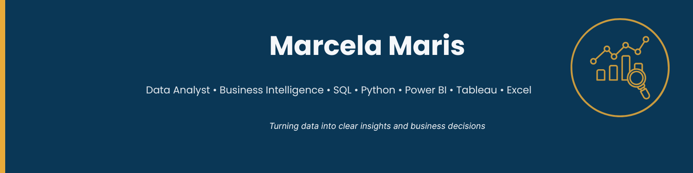

  

# 👋 Hi, I'm Marcela Maris
🎯 Data Analyst | Business Analyst • SQL • Python • Excel • Power BI • Tableau • Data Visualisation | Education • Business • Finance • Marketing

## 🚀 About Me
> I’m a **Data Analyst** with a strong foundation in **Mathematics (University of São Paulo – USP)** and over ten years of experience in the **publishing** and **education industry**, where I used **data** to support **strategic**, **operational**, and **financial decisions**.
>
> Throughout my career, I’ve applied **analytical thinking**, **project coordination**, and **performance tracking** to improve **efficiency**, **optimise processes**, and **align teams** around measurable outcomes. These experiences built my ability to **translate complex datasets into clear insights** that drive smarter **business decisions**.
>
> After relocating to **London**, I expanded my **technical expertise** through the **Meta / TripleTen Data Analytics Certificate**, developing hands-on projects using **Python**, **SQL**, **Power BI**, **Tableau**, and **Excel**. My recent work includes **dashboards**, **cohort analysis**, **ROI measurement**, and **predictive modelling** applied to **marketing**, **financial**, and **business intelligence** scenarios.
>
> Currently, I apply my skills through **independent projects** and **freelance collaborations**, focusing on **transforming data into actionable stories** and supporting **data-driven strategies**.
>
> 🔍 **Open to opportunities** in **Data Analytics**, **Business Intelligence**, and **Performance Insights** — across sectors such as **Education**, **Finance**, and **Marketing**.
> 🌍 **Based in London, UK** | **Right to Work (Spouse Visa)** | **On-site / Hybrid / Remote**

---
## 🧰 Tools & Technologies

  <!-- Languages & Data -->
  
  
  
  

  <!-- Visualisation & BI -->
  
  
  
  

- **Languages & Data:** Python (Pandas, Matplotlib, Seaborn, Plotly), SQL  
- **Visualisation & BI:** Tableau, Power BI, Streamlit, Dash  
- **Analytics:** Data cleaning, Exploratory Data Analysis, Hypothesis Testing, A/B Testing  
- **Productivity:** Excel / Google Sheets  
- **Soft skills:** Project coordination, Problem-solving, Communication, Cross-cultural teamwork

---

## 📂 Featured Projects

A curated selection of **end-to-end data analytics projects** demonstrating skills across **data cleaning**, **exploratory analysis**, **visualisation**, and **business insight generation** — covering **marketing**, **product**, **education**, and **business intelligence** domains.
Each project applies real-world analytical workflows using **Python**, **SQL**, **Tableau**, **Power BI**, and **Streamlit**, transforming data into **actionable insights** that support **data-driven decision-making**.

*Note: Projects use public or educational datasets and represent simulated business scenarios.*

---

* #### 💰 [E-Commerce Performance & ROMI Analysis](https://github.com/MarcelaMaris/E-Commerce-Performance-ROMI-Analysis) 
  Analysis of **marketing efficiency, user behaviour, and financial performance** for an e-commerce platform.
  Combined **cohort analysis**, **LTV/CAC computation**, and **ROMI evaluation** to identify the most cost-effective acquisition channels and profitable customer cohorts.
  Included **incomplete-cohort filtering** and a **ROMI sensitivity analysis (±10%)** to validate model robustness.
  Results were summarised in an **interactive Tableau dashboard**, supporting **data-driven marketing optimisation** and **business growth decisions**.

---

* #### 🛒 [Customer Segmentation & Churn Analysis](https://github.com/MarcelaMaris/Customer-Segmentation-Churn-Analysis) 
  Focused on **customer segmentation** and **churn prediction** using transactional data.
  Implemented **data cleaning**, **exploratory analysis**, **K-Means clustering**, and **predictive modelling** with **Logistic Regression** and **Random Forest**.
  Delivered insights through an **interactive Tableau dashboard**, supporting **targeted marketing strategies** and **retention campaigns**.
  [Live Tableau Dashboard](https://public.tableau.com/app/profile/marcela.stephanie.pereira.maris1628/viz/DashboarddeAnlisedeClientes/Dashboard1)

---

* #### 📱 [User Behaviour Funnel & A/A/B Testing](https://github.com/MarcelaMaris/User-Behaviour-Funnel-A-B-Testing) 
  Simulated a **product analytics scenario** to evaluate **user conversion** and **app engagement** for a food delivery platform.
  Built **behavioural funnels** (Main → Offers → Cart → Payment) and conducted **A/A/B tests** using **two-proportion Z-tests with Bonferroni correction** to ensure statistical validity.
  Included **temporal sequencing**, **date consistency validation**, and **group balance checks** for data quality.
  Findings helped assess **conversion efficiency** and support **evidence-based product decisions**.

---

* #### 🎥 [YouTube Trending Analysis Dashboard](https://github.com/MarcelaMaris/YouTube-Trending-Analysis-Dashboard)
  End-to-end Tableau project analysing **global YouTube trending videos**, exploring **category distribution, regional popularity, and temporal dynamics**.
  Built an **interactive Tableau Public dashboard** to visualise global trends and regional preferences (US, France, India, Japan, Russia).
  The workflow covered **data aggregation, transformation, dashboard design, filter integration**, and **insight extraction**.
  [Live Tableau Dashboard](https://public.tableau.com/app/profile/marcela.stephanie.pereira.maris1628/viz/YoutubeTreendingDashboard-final/Dashboard1) · [Presentation (PDF)](https://1drv.ms/b/c/d1aeda57ea1dab69/ETe6SLqfANVPtnPp9PAoVTABSbvMgP2WEDA1WBingSMKIA?e=0Y2jAV)
---
* #### 📊 [Education Performance Interactive Dashboard](https://github.com/MarcelaMaris/Education-Performance-Interactive-Dashboard)
  Interactive dashboard built with **Streamlit** and **Plotly** to analyse **student performance metrics** from national exam data.
  Explored **achievement patterns by gender, subject, and age group**, demonstrating **visual storytelling** and **app deployment** skills.
  Highlighted how **educational data** can be transformed into **actionable insights** for policy and performance evaluation.
  [Live Dashboard](https://dashboard-enem-tvu8.onrender.com)

---

* #### 🧪 [A/B Testing — Recommender System Experiment](https://github.com/MarcelaMaris/AB-Testing-Recommender-System-Experiment)
  Simulated a **product optimisation experiment** to assess the impact of a **new recommender system** on user conversion.
  Included **data validation**, **conversion funnel construction**, **exploratory analysis**, and **proportion Z-tests** to evaluate statistical significance.
  Findings informed **data-driven product rollout** and **feature-adoption strategies**.
  
---

* #### 📚 [Business Reporting with SQL – Multi-table Data Exploration](https://github.com/MarcelaMaris/Business-Reporting-with-SQL-Multi-table-Data-Exploration)
  Demonstrated **SQL-based data modelling** and **KPI generation** using a **multi-table relational dataset**.
  Covered **schema validation**, **data quality checks**, and **analytical queries** for **financial performance** and **category trend analysis**.
  Results were summarised in **visual reports** simulating **business intelligence dashboards**, supporting **strategic and financial reporting** workflows.
  
---

## 🎓 Certifications

- 🏅 **Meta Data Analytics Professional Certificate**  
- 📊 **TripleTen Data Analytics Bootcamp**

---

## 🌐 Let's Connect

- 💼 [LinkedIn](https://www.linkedin.com/in/marcela-maris-642b6938/)  
- 📧 [Email](mailto:marcelaspmaris@gmail.com)  

